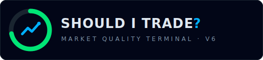
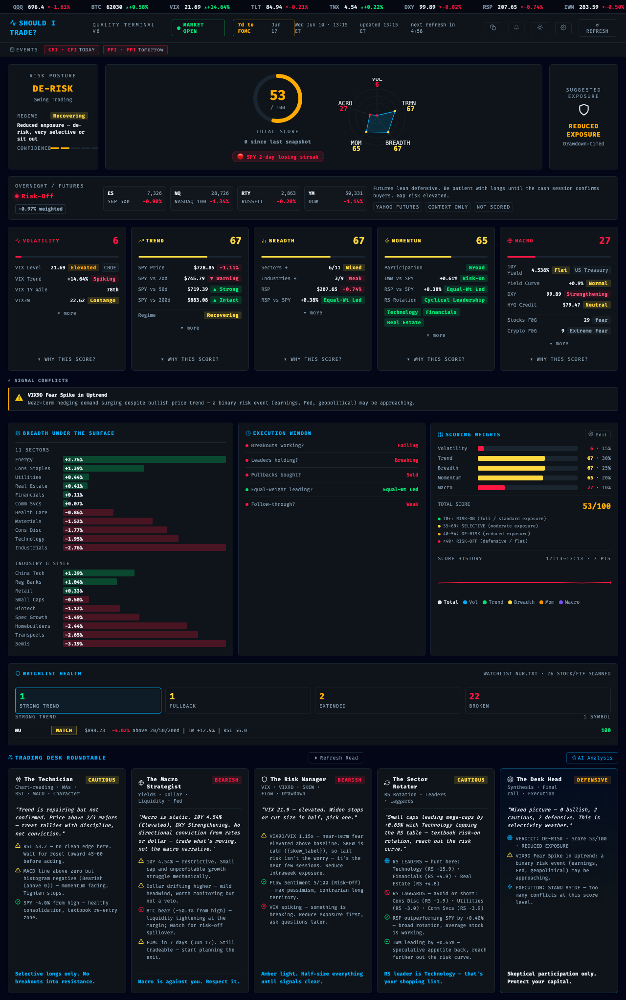

<p align="center"></p>

# Should I Trade? — Market Quality Terminal v6

A single-page, self-hosted **risk / de-risk gauge** for the session: it reads the market regime and tells you **how much market exposure the current environment is worth.**

No subscriptions, no API keys, no cloud dependencies — all data comes from free public sources.

> **What the score is (and isn't).** A 2005–2026 walk-forward backtest showed the composite Market Quality Score is a **drawdown/exposure timer, not a forward-return predictor.** A "stay-long-when-score-is-high, de-risk-when-low" rule beat buy-and-hold on risk-adjusted return out-of-sample (Sharpe 1.07 vs 0.94) and cut max drawdown from ~−32% to ~−12% (2016–26). It does **not** predict which days will be profitable — read it as a risk dial, not a green light. The engage line is **55**, not 70.

---

## Screenshot



> Live dashboard running at `http://localhost:8765`

The dashboard shows a composite **Market Quality Score (0–100)**, five scoring pillars, a trading decision recommendation, and a multi-persona AI roundtable discussion — all updated automatically every 60 seconds.

---

## Features

| Feature | Detail |
|---|---|
| **Market Quality Score** | 0–100 composite score across 5 weighted pillars |
| **5-Pillar Breakdown** | Volatility · Trend · Breadth · Momentum · Macro |
| **Risk Posture Badge** | RISK-ON / CONSTRUCTIVE / SELECTIVE / DE-RISK / RISK-OFF — exposure recommendation for the session |
| **Trading Desk Roundtable** | 5 rule-based AI personas (Technician, Macro, Risk, Quant, Desk Head) |
| **Score Sparkline** | 12-hour rolling history chart with persistent storage |
| **Economic Calendar** | FOMC & key econ event proximity alerts (through Dec 2027) |
| **Sector Heatmap** | All 11 SPDR sectors + 9 industry subsector ETFs |
| **Market Conditions** | SPY, QQQ, VIX, VIX3M, HYG, GLD, DXY, TLT, 10Y yield, BTC |
| **Watchlist Health** | Scores your personal watchlist symbols (TradingView format supported) |
| **Health & Metrics** | `/health` and `/metrics` endpoints for monitoring |
| **Rate Limiting** | 30 req/min per IP — protects against runaway polling |
| **Responsive UI** | Works on laptop screens down to ~600px wide |
| **Zero API keys** | Yahoo Finance → Stooq → CoinGecko → Binance (all free) |

---

## Quick Start

### Requirements
- **Python 3.10+** (uses union type hints `X | Y` and `match` statements)
- **Core app: standard library only** — no pip install needed to run
- Optional: `pip install google-genai` + a free Gemini key enables the AI Desk Head
  (everything else works without it — rule-based roundtable is the fallback)
- Optional (dev only): Node 20 for JS lint/tests (`npm ci && npm test`)

### Run
```bash
git clone git@github.com:Nabulizi/should-i-trade.git
cd should-i-trade
python3 server.py
```

Then open **http://localhost:8765** in your browser. The first load takes ~7–8 seconds as it fetches live data for 33 symbols in parallel.

> The server auto-opens the browser on startup. Re-open manually if needed.

---

## Project Structure

```
should-i-trade/
├── server.py              # HTTP server, routing, caching, SSE, history persistence
├── scoring.py             # 5-pillar scoring engine (0–100 per pillar, weighted composite)
├── data.py                # Market data fetchers (Yahoo Finance + fallbacks, circuit breakers)
├── analysis.py            # Rule-based multi-persona trading desk roundtable
├── ai_synthesis.py        # Optional Gemini-powered roundtable (falls back to analysis.py)
├── watchlist.py           # TradingView watchlist import + symbol health scorer
├── backtest.py            # Walk-forward replay: IC, decile, regime & strategy tests
├── backtest_experiment.py # Scratchpad for weight/threshold experiments
├── config.py              # ← All user-tunable settings (port, TTLs, weights, WL thresholds)
├── config_local.py        # (git-ignored) your local secrets, e.g. GEMINI_API_KEY
├── models.py              # TypedDict schemas (Quote, PillarResult, DashboardResult)
├── should-i-trade-v5.html # Single-page dashboard shell
├── static/
│   ├── app.js             # Dashboard rendering (vanilla JS, no frameworks)
│   ├── app.css            # Terminal theme (dark + light), responsive ≥600px
│   └── app.test.js        # Vitest unit tests for the JS helpers
├── assets/logo.svg        # Project mark
├── watchlists/            # Drop TradingView .txt exports here
├── test_scoring.py        # Scoring pillar unit tests
├── test_data.py           # Data layer + circuit-breaker tests
├── test_analysis.py       # Roundtable persona tests
├── test_fixes.py          # Script-style infra regression suite (python3 test_fixes.py)
├── .github/workflows/     # CI: Python 3.10–3.12 matrix + JS lint/tests
├── requirements.txt       # Notes only — core app needs no pip packages
└── history.json           # Auto-generated at runtime; score history for sparkline
```

Run the full Python suite with `python3 -m unittest discover` (test_fixes.py
is script-style and skips itself under discovery — run it directly as CI does).

---

## Architecture

```
Browser ──GET /──────────────────► server.py
                                       │
                          ┌────────────▼────────────┐
                          │  _DASHBOARD_CACHE (60s)  │
                          └────────────┬────────────┘
                                       │ cache miss
                          ┌────────────▼────────────┐
                          │     scoring.py           │
                          │  compute_dashboard()     │
                          │  ~7.4s, 33 symbols       │
                          └──┬───┬───┬───┬───┬──────┘
                             │   │   │   │   │
                           Vol Trd Brd Mom Mac
                             └───┴───┴───┴───┘
                              Weighted composite
                                     │
                          ┌──────────▼──────────┐
                          │     analysis.py      │
                          │    roundtable()      │
                          │  5 AI personas +     │
                          │  Desk Head synthesis │
                          └─────────────────────┘
```

Data flows: `data.py` fetches from Yahoo Finance (primary), falling back to Stooq (equities), CoinGecko (BTC), or Binance (BTC) as needed. All fetches happen in parallel using `ThreadPoolExecutor`.

---

## Scoring System

### Pillars & Weights

| Pillar | Weight | What it measures |
|---|---|---|
| **Trend** | 30% | SPY MA stack (20/50/200), RSI, MACD, ATR, volume confirmation |
| **Breadth** | 25% | Sector & industry advance/decline, RSP vs SPY, % sectors above 200d |
| **Momentum** | 20% | RSP/SPY relative strength, IWM leadership, sector RS rotation |
| **Volatility** | 15% | VIX level/trend/percentile, VIX term structure, VIX9D, SKEW, flow |
| **Macro** | 10% | 10Y yield, DXY, yield curve, HYG credit, BTC, GLD, FOMC proximity |

> Weights are defined in `config.py` and can be adjusted without touching logic files.

### Risk-Posture Thresholds

The score is a regime/exposure dial. The **engage line is 55** (validated as the efficient long/flat cut), not 70.

| Score | Posture | Suggested Exposure |
|---|---|---|
| ≥ 85 | **RISK-ON** 🟢 | Full |
| 70–84 | **CONSTRUCTIVE** 🟢 | Standard |
| 55–69 | **SELECTIVE** 🟡 | Moderate — engage selectively |
| 40–54 | **DE-RISK** 🟠 | Reduced |
| < 40 | **RISK-OFF** 🔴 | Defensive / flat |

---

## API Endpoints

| Endpoint | Method | Description |
|---|---|---|
| `GET /` | — | Serves `should-i-trade-v5.html` |
| `GET /api/dashboard` | — | Full scoring payload (JSON, cached 60s) |
| `GET /api/watchlist-health` | — | Watchlist symbol scores (cached 5min) |
| `GET /api/history-scores` | — | Rolling 12-hour score history |
| `GET /api/analysis` | — | Trading desk roundtable result |
| `GET /health` | — | Server uptime, cache state, history count |
| `GET /metrics` | — | Request/hit/miss/error counters |

### `/health` example response
```json
{
  "status": "ok",
  "uptime_seconds": 3721,
  "cache_age_seconds": 14,
  "cache_fresh": true,
  "history_count": 48
}
```

### `/metrics` example response
```json
{
  "requests": 412,
  "cache_hits": 398,
  "cache_misses": 14,
  "errors": 0,
  "dashboard_ttl_seconds": 60,
  "uptime_seconds": 3721
}
```

### Rate Limiting
All `/api/*` endpoints are rate-limited to **30 requests per minute per IP**.  
Exceeding the limit returns `HTTP 429 Too Many Requests`.  
Limits are configurable in `config.py` (`RATE_LIMIT_MAX`, `RATE_LIMIT_WINDOW`).

---

## Configuration

All user-tunable settings live in **`config.py`** — edit that file instead of touching logic code:

```python
# config.py

PORT           = 8765   # listening port
DASHBOARD_TTL  = 60     # seconds between full market-data refreshes
WATCHLIST_TTL  = 300    # seconds between watchlist recomputes
HISTORY_MAXLEN = 144    # max sparkline snapshots (~12 h at 5-min intervals)

RATE_LIMIT_MAX    = 30  # max API requests per IP per window
RATE_LIMIT_WINDOW = 60  # window in seconds

PILLAR_WEIGHTS = {      # must sum to 1.0
    "volatility": 0.15,
    "trend":      0.30,
    "breadth":    0.25,
    "momentum":   0.20,
    "macro":      0.10,
}
```

**Secrets stay out of git.** For machine-specific values (e.g. `GEMINI_API_KEY`
for the optional AI Desk Head), create a `config_local.py` next to `config.py`
— it is git-ignored and overrides any value in `config.py`:

```python
# config_local.py  (never committed)
GEMINI_API_KEY = "your-key-here"
```

The `GEMINI_API_KEY` environment variable still takes priority over both files.

---

## Data Sources

All sources are free and require no authentication:

- **Yahoo Finance v8 API** — primary source for all equity/ETF quotes and history
- **Stooq CSV** — fallback for equity data if Yahoo returns empty
- **CoinGecko API** — BTC price fallback
- **Binance public API** — BTC price secondary fallback

### Economic Calendar

Key US economic release dates (NFP, CPI, PPI, GDP) and FOMC meeting dates are stored in `data.py`.  
Current coverage: **through December 2027**.  
The server logs a `WARNING` automatically when coverage drops below 30 days — check logs if you see stale econ/FOMC data.  
Update `_ECON_CALENDAR` and `_FOMC_2026_2027` in `data.py` annually.

---

## Running Tests

```bash
python3 test_fixes.py    # 48 infrastructure + security regression tests
python3 test_scoring.py  # 75 scoring pillar unit tests (fully offline)
```

CI runs both suites automatically on every push via GitHub Actions (Python 3.10, 3.11, 3.12).

---

## Notes

- `history.json` is auto-created at runtime and excluded from version control (see `.gitignore`). It stores up to 144 snapshots (~12 hours at 5-minute intervals) for the sparkline chart.
- The server uses a `ThreadingHTTPServer` so parallel browser tabs don't each trigger separate full data fetches — the 60-second cache handles that.
- The roundtable analysis is fully rule-based (deterministic) — no LLM or external AI API is used.
- Path traversal is blocked at the file-serving layer: requests for any file outside the project directory return `403 Forbidden`.

---

## Author

Built by **Nueraili Abulizi** as a personal pre-session market quality tool.
